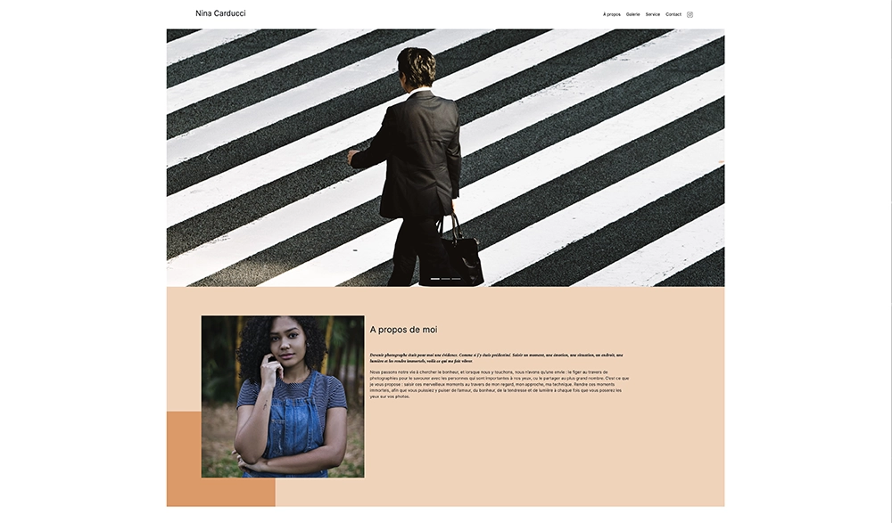

# Portfolio de Nina Carducci - Photographe

## Projet OpenClassrooms

## Contexte

Ce projet est le portfolio en ligne de Nina Carducci, une photographe basée à Bordeaux. Il a été amélioré pour assurer une meilleure accessibilité, des performances optimisées et un bon référencement SEO.

## Objectif

Améliorer et optimiser le portfolio de Nina Carducci pour offrir une meilleure expérience utilisateur, des performances accrues et un référencement SEO optimisé.

## Fonctionnalités

- **Présentation des projets** : Présentation des projets de photographie de Nina Carducci, avec des images de haute qualité et des descriptions détaillées.
- **Navigation par catégories** : Possibilité de naviguer à travers les différentes catégories de projets, comme les mariages, les portraits, les concerts, etc.
- **Formulaire de contact** : Formulaire permettant aux visiteurs de prendre contact avec Nina Carducci pour des demandes de projets ou de collaboration.

## Améliorations apportées

- **Débogage** : Correction des bugs et des erreurs dans le code du portfolio pour assurer un bon fonctionnement du site.
- **Accessibilité** : Amélioration de l'accessibilité du site en ajoutant des balises sémantiques appropriées, en assurant une navigation claire et en rendant le site utilisable pour les utilisateurs ayant des handicaps visuels.
- **Performances** : Optimisation des performances du site en compressant les images, en minimisant les fichiers CSS et JavaScript, en utilisant des techniques de mise en cache et en optimisant la vitesse de chargement des pages.
- **SEO** : Optimisation du référencement du site en ajoutant des balises méta appropriées, en optimisant les URL, en ajoutant des balises d'en-tête appropriées et en améliorant la structure du site pour une meilleure indexation par les moteurs de recherche.

## Les petits plus

- **Politique de mise en cache** : Création d'un fichier `.htaccess` à la racine du projet pour une maîtrise du cache contrôle.
- **Contrôle du crawl** : Rédaction d'un fichier `robots.txt` ainsi qu'un `sitemap.xml` pour que les bots Google et autres puissent crawler le site efficacement.
